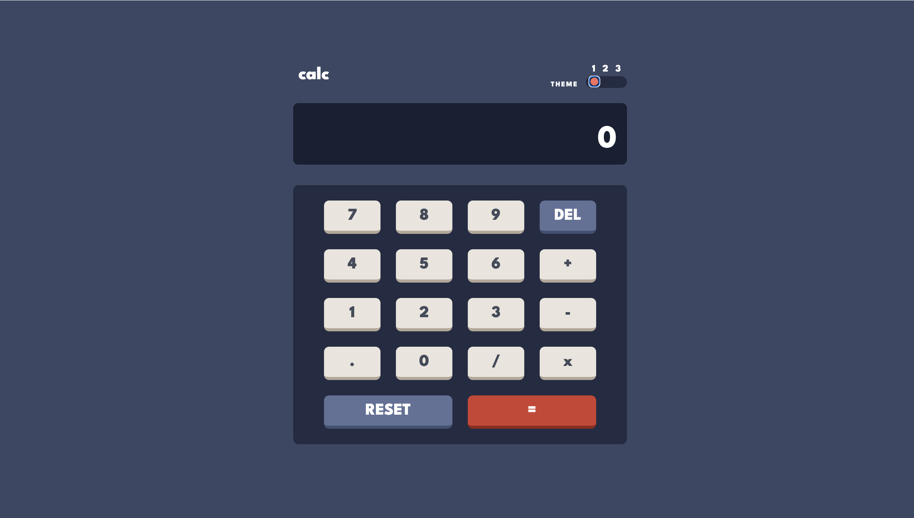

# Frontend Mentor - Calculator app solution

This is a solution to the [Calculator app challenge on Frontend Mentor](https://www.frontendmentor.io/challenges/calculator-app-9lteq5N29). Frontend Mentor challenges help you improve your coding skills by building realistic projects. 

## Table of contents

- [Overview](#overview)
  - [The challenge](#the-challenge)
  - [Screenshot](#screenshot)
  - [Links](#links)
- [My process](#my-process)
  - [Built with](#built-with)
  - [What I learned](#what-i-learned)
  - [Continued development](#continued-development)
  - [Useful resources](#useful-resources)
- [Author](#author)
- [Acknowledgments](#acknowledgments)

## Overview

### The challenge

Users should be able to:

- See the size of the elements adjust based on their device's screen size
- Perform mathmatical operations like addition, subtraction, multiplication, and division
- Adjust the color theme based on their preference
- **Bonus**: Have their initial theme preference checked using `prefers-color-scheme` and have any additional changes saved in the browser

### Screenshot

### Links

- Solution URL: [https://github.com/DeanDodds/calculator-solution](https://github.com/DeanDodds/calculator-solution)
- Live Site URL: [https://deandodds.github.io/calculator-solution/](https://deandodds.github.io/calculator-solution/)

## My process

### Built with

- Semantic HTML5 markup
- CSS custom properties
- Flexbox
- CSS Grid
- Mobile-first workflow

### Useful resources

- [Change Website Colors with CSS and Javascript | Light and Dark Mode Toggle](https://www.youtube.com/watch?v=3Kterjsc74s) - Learn how to change the color theme of your website (also dark/light mode) with a click of a button.

## Author

- Website - [Dean Dodds](https://deandoddsdevelopment.000webhostapp.com/)
- Frontend Mentor - [@DeanDoods](https://www.frontendmentor.io/profile/DeanDodds)
- GitHub - [DeanDodds](https://www.twitter.com/yourusername)

**Note: Delete this note and add/remove/edit lines above based on what links you'd like to share.**

## Acknowledgments

The Stack Over Flow Community 

